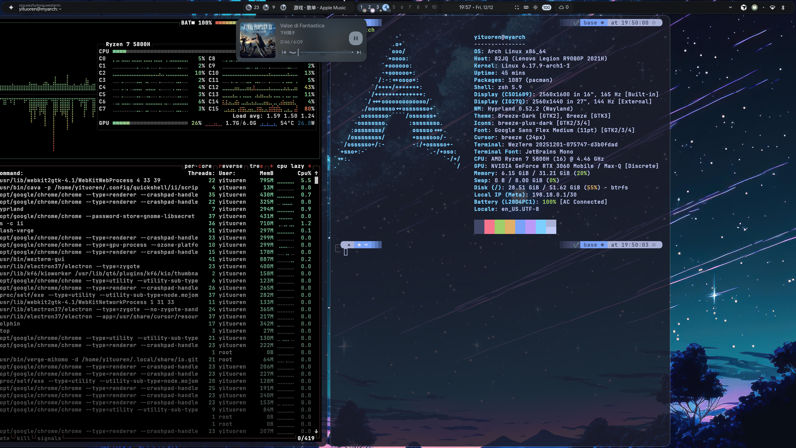

# My Personal Arch Dotfiles

These are my custom configuration files for my Arch Linux. 

You are welcome to copy any of them for your own use, but remember to give the original repo a star! 

If you find this repo helpful, please give it a star. 

## Content

### Window Manager & Desktop Shell

- [hyprland](https://github.com/hyprwm/Hyprland)
    - [hyprscrolling](https://github.com/hyprwm/hyprland-plugins)
- [illogical-impulse-quickshell](https://github.com/end-4/dots-hyprland)

### Terminal & Shell

- zsh: shell
- [powerlevel10k](https://github.com/romkatv/powerlevel10k): prompt & theme
- [zimfw](https://github.com/zimfw/zimfw): plugin manager
- [wezterm](https://github.com/wezterm/wezterm): terminal simulator

### Input Method

- [fcitx5](https://github.com/fcitx/fcitx5): input method framework
- [rime](https://github.com/fcitx/fcitx5-rime): engine
- [rime-ice](https://github.com/iDvel/rime-ice): configuration
- [candlelight](https://github.com/thep0y/fcitx5-themes-candlelight): theme

## Final Appearance

By the way, the wallpaper is in "assets/wallpaper.jpg", enjoy yourself!
